# kaggle
code for kaggle compitions

## Exercise: The Convolutional Classifier

二分类常用的损失函数： binary_crossentropy

常用的评价指标： binary accuracy

keras的模型设定：
```python
model = keras.Sequential([
    pretrained_base,
    layers.Flatten(),
    # YOUR CODE HERE. Attach a head of dense layers.
    layers.Dense(units=6,activation='relu'),
    layers.Dense(units=1,activation='sigmoid')
])
```
> keras.Sequential([...])

这是 Keras 中创建模型的一种简单方式，按顺序堆叠网络层，形成一个“线性”模型。

> layers.Flatten()

把预训练模型输出的多维特征图展平为一维向量。
例如，如果上一层输出是形状 (batch_size, h, w, c)，flatten 后变成 (batch_size, h*w*c)。

> layers.Dense(units=6, activation='relu')

这是一个全连接（Dense）层，有6个神经元（units=6）。
使用 ReLU 激活函数，给模型增加非线性能力。
这是你添加的“头部”层的一部分，目的是进一步处理特征，提取高级信息。

> layers.Dense(units=1, activation='sigmoid')

最后一层全连接层，只有1个神经元，激活函数是 Sigmoid。
通常用于二分类任务，输出一个介于0和1之间的概率值，表示属于正类的概率。

## Convolution and ReLU
特征提取的三步骤： filter，detect ，condense

1. Filter an img/image for a particular feature (convolution)
2. Detect that feature within the filtered img/image (ReLU)
3. Condense the img/image to enhance the features (maximum pooling)

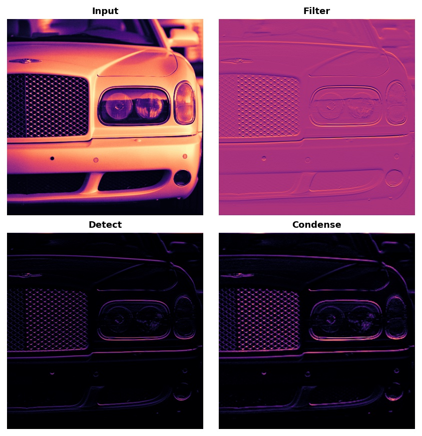

### Activations

卷积层的特征提取：
```python
model = keras.Sequential([
    layers.Conv2D(filters=64, kernel_size=3), # activation is None
    # More layers follow
])
```
filter 的数量代表多少个卷积核，生成多少种二维特征图。每个卷积核生成一个。(权重不同，生成的特征图不同)

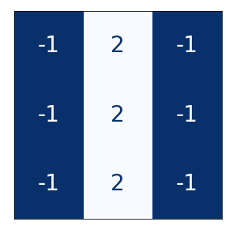

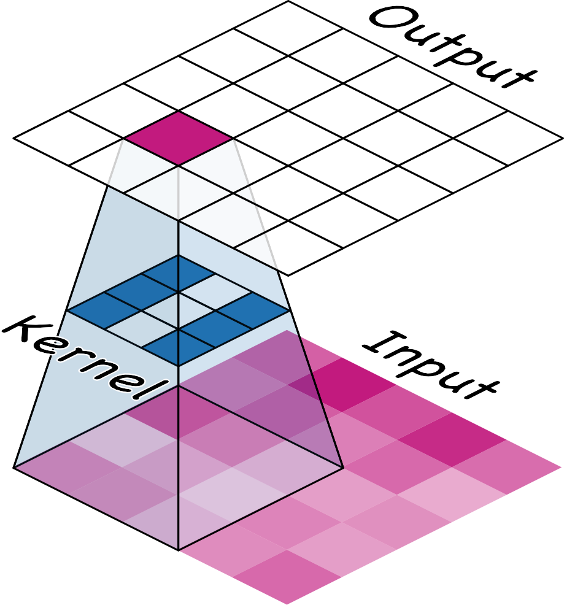

kernel_size 是卷积核的大小，默认为3，3x3的卷积核。

卷积核的激活：不同卷积核强调的位置就是卷积核中数字为正的位置。

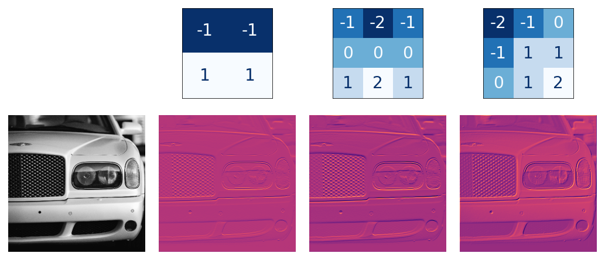

左边和中间的卷积核生成的图片强调的是横向特征。


### Detect with ReLU


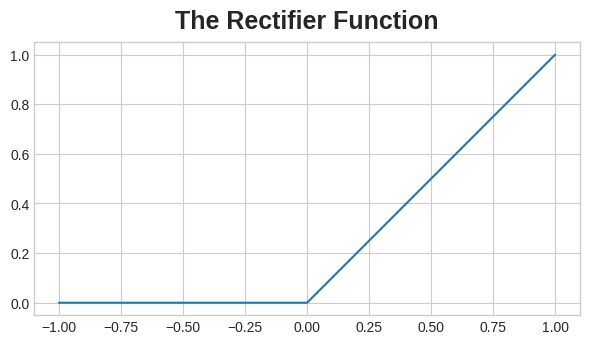

ReLU是平等的让所有不重要的地方都不重要，设置成0.下面是激活之后的结果：

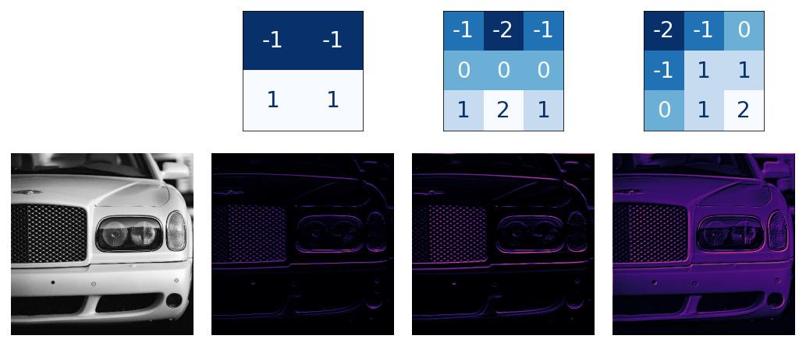


### Max Pooling

池化层类似与一个卷积层，但是用的是最大值函数

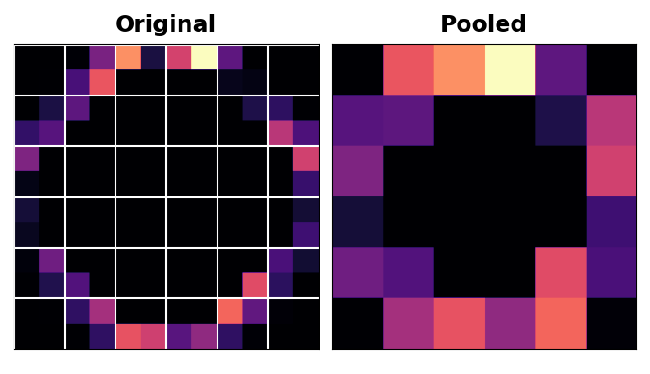

我们在ReLU之后采用最大池化层，这样就可以增大激活的像素

```python
layers.MaxPool2D(pool_size=2)
# 没有参数
```

但我们使用池化过程时，我们不可避免地丢失信息

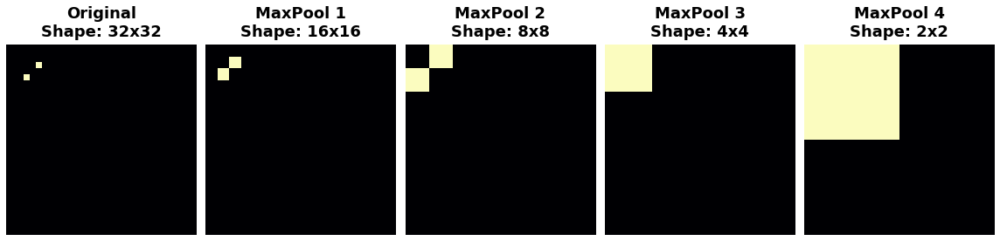

可见经过3次池化，我们丢失了信息。池化过程破坏了位置信息。但是实际上破坏的只是短距离的位置信息，远距离的位置信息仍会保留。这其实是好事，我们希望发生位置变化时，仍然能够识别出来。

Global Average Pooling 起到Flatten的作用

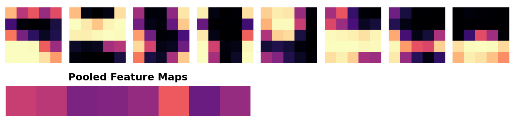

> 轿车和卡车的池化特征差异是否足以区分它们？你会如何解读这些池化值？这对分类有何帮助？

VGG16 基础模型生成 512 张特征图。我们可以将每张特征图视为原始图像中某个高级视觉特征的代表——例如车轮或窗户。池化后，每个特征图会返回一个数字，我们可以将其视为该特征的得分：如果该特征存在，则得分较大；如果不存在，则得分较小。汽车往往在一组特征上得分较高，而卡车则在另一组特征上得分较高。现在，头部无需尝试将原始特征映射到类别，只需处理 GlobalAvgPool2D 生成的这些得分即可，这对它来说更容易解决。

## The Sliding Window

### stride


有两个额外的参数会影响卷积层和池化层——窗口的步长以及是否在图像边缘使用填充。步长参数表示窗口每一步应该移动多远，而填充参数则描述我们如何处理输入边缘的像素。

```python
from tensorflow import keras
from tensorflow.keras import layers

model = keras.Sequential([
    layers.Conv2D(filters=64,
                  kernel_size=3,
                  strides=1,
                  padding='same',
                  activation='relu'),
    layers.MaxPool2D(pool_size=2,
                     strides=1,
                     padding='same')
    # More layers follow
])
```

窗口每次移动的距离叫做步长。上面的gif展示的是步长为1情况，下面为步长为2


有时候可以使用(2,2) (3,3)的步长，但是一般不大于感受野

### padding

当我们设置 padding='valid' 时，卷积窗口将完全保留在输入内。缺点是输出会缩小（丢失像素），并且对于较大的内核，缩小幅度会更大。这会限制网络可以包含的层数，尤其是在输入较小的情况下。

另一种方法是使用 padding='same'。这里的技巧是在输入的边界周围填充 0，使用刚好足够的 0 来使输出的大小与输入的大小相同。然而，这可以稀释边界像素的影响。下面的动画展示了一个使用“same”填充的滑动窗口。


有时，模型会在初始层使用步长较大的卷积。这通常也会与更大的卷积核相结合。比如resnet50 使用 $7\times 7$卷积核和步长为2。

### The Receptive Field


现在追溯顶部神经元的连接，你会发现它连接到输入（底层）中一个 5×5 像素的块：中间层 3×3 像素块中的每个神经元都连接到一个 3×3 输入块，但它们在一个 5×5 像素块上重叠。因此，顶部神经元具有 5×5 的感受野。

感受野的计算：

第一层卷积层的输出特征图像素的感受野大小等于卷积核大小，其它卷积层的输出特征图的感受野的大小和它之前所有层的卷积核大小和步长有关系。
在下图中，输入图形的大小是5x5，假设保持滑动窗口的步长stride=1，padding=0,经过第一次卷积，得到的特征图大小是3x3,经过第二层卷积，得到的特征 图大小是1x1，所以第一层特征图的感受野是3x3,第二层特征图的感受野是5x5。

感受野计算公式：

$$ l_k = l_{k-1} + ((f_k - 1) \times \prod_{i=1}^{k-1} s_i)
$$

其中$l$是感受野大小，$f$是卷积核大小，$s$是步长。
为什么始终是$f_k - 1$?这是因为占的就是哪一个的边。乘的是stride。 

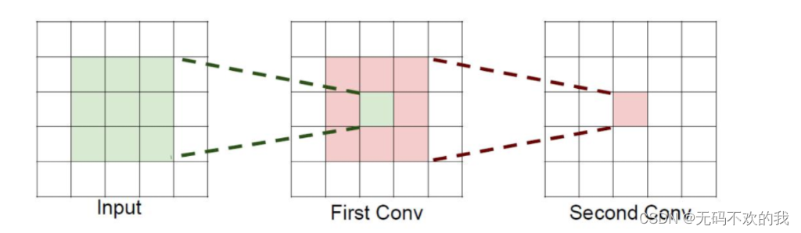

那么有人肯定有这个疑问，上图的卷积过程需要经过两次卷积才可以将原始输入图形变成1x1的特征图，这跟使用一个5x5的卷积核进行一次卷积得到的特征图 的结果是一样的，那为什么非要进行两处卷积呢？

假设输入大小都是hxwxc，并且都使用c个卷积核(得到c个特征图)，可以来计算一下其各自所需参数：

$$ 总参数量 = (核面积 \times 输入通道数) \times 输出通道数$$

一个5x5的卷积所需参数：cx(5x5xc)=25c^2

2个3x3卷积核所需参数：2xcx(3x3xc)=18c^2

很明显，堆叠小的卷积核所需的参数更少一些，并且卷积过程越多，特征提取也会越细致，加入的非线性变换也随着增多（因为通常情况下每个卷积层后面一般 都加激活函数，这些激活函数可以完成非线性变换，所以卷积层越多，非线性变换也随着增多），还不会增大权重参数个数，这就是VGG网络的基本出发点，用 小的卷积核来完成体特征提取操作。

这里为什么有两个c?因为输入为 $H \times W \times C$，单个卷积核需要计算就是 $H \times W \times C$计算量。但是我们如果需要多个输出结果，就需要对应数量的卷积核。但是一般输出通道等于输入，所以是c方。这里多个卷积核可以认为是提取不同特征用的，内部往往不同。如果只用一个卷积核，RGB都照顾不全，输出为$H \times W \times 1$

如果有偏置，应当直接加上去


## Custom Convnets

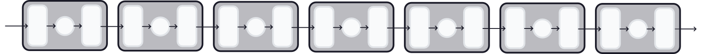

特征提取通过多个卷积块进行，每个卷积块由卷积层、激活层、池化层组成

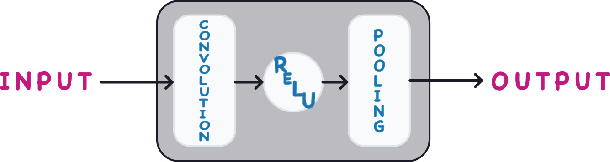

根据VGGNet和ResNet的思路，特征图的数量filters在Block中保持一致。哪怕一个Block中有多个Conv层，也要一样的filters

## Data Augmentation

keras提供两种数据增强方式:

1. img/imageDataGenerator
2. preprocessing_layers


```python
model = keras.Sequential([
    # Preprocessing
    preprocessing.RandomFlip('horizontal'), # flip left-to-right
    preprocessing.RandomContrast(0.5), # contrast change by up to 50%
    # Base
    pretrained_base,
    # Head
    layers.Flatten(),
    layers.Dense(6, activation='relu'),
    layers.Dense(1, activation='sigmoid'),
])
```

## SGD
Stochastic Gradient Descent, 随机梯度下降

### 基本梯度下降

假设目标是最小化一个损失函数$L(\theta)$,参数是$\theta$ ，学习率是$\eta$,那么普通梯度下降公式是 
$$ \theta_{t+1} = \theta_t - \eta \nabla_\theta L(\theta_t)
$$

$\nabla_\theta L_{\theta_{t}}$ 告诉我们损失在各个维度的变化方向和大小。

$\eta$ 学习率，控制每次参数更新的幅度。

更新方向是梯度的反方向，因为梯度指向上升最快的方向，我们要往下降

### 随机梯度下降 SGD

$$ \theta_{t+1} = \theta_t - \eta \nabla_\theta L(\theta_t)
$$

普通梯度下降每次都要用全量数据集计算梯度，这在大数据集上很慢。SGD 用的是 单样本 或 小批量（Mini-batch） 来近似梯度：

$L_i(\theta_t)$ 只计算某个样本i或者一个batch的损失。但是梯度是近似的，会带上噪声，路径会抖动。

### 加动量的SGD (Momentum)

为了减少这种抖动，常加上动量项$v_t$

$$ v_t = \beta v_{t-1} + \eta \nabla_\theta L_i(\theta_t) $$

$\beta$ 动量系数，常取0.9
类似惯性，上一次的梯度会加到当前梯度上，下降更平滑